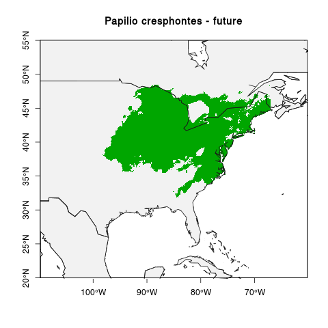
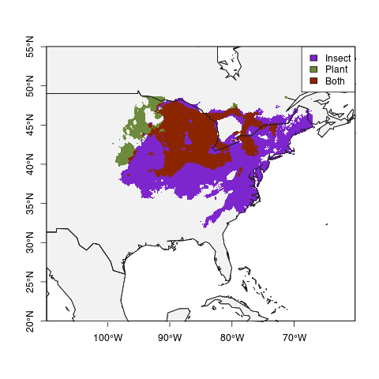

# Species Distribution Modeling
## Instructions
This document includes instructions for running species distribution modeling analyses and creating graphics. If you encounter problems, there are troubleshooting tips available on the [Troubleshooting](troubleshooting.md) page.

### Installations
1. Install [R](http://cran.r-project.org/mirrors.html)
2. Install [RStudio](https://www.rstudio.com/products/rstudio/)
3. Install [Git](https://git-scm.org/downloads) **and** look at the Git section of the [Troubleshooting](troubleshooting.md#git) page.

_Aside: [What's the difference between R/RStudio & Git/GitHub, anyway?](#git-vs-github)_

### Setup
1. Open RStudio and clone the Git repository at [https://github.com/jcoliver/biodiversity-sdm-lesson.git](https://github.com/jcoliver/biodiversity-sdm-lesson.git). If you're not sure how to do this, take a look at point #3 "Cloning a repository" in the Git section of the [Troubleshooting](troubleshooting.md#git).
2. Run the setup script in RStudio by running this command in the **Console** tab of RStudio:
    `source(file = "scripts/setup.R")`
    This script may take a while to run, depending on the speed of your machine and internet connection. Note also that it may ask you if you want to restart R before installing/upgrading packages; if you receive this prompt, answer **Yes** to restarting R. This script installs additional R packages necessary for analyses, makes sure the `data` folder exists, and downloads climate data necessary to run the species distribution models. If you are prompted to choose a CRAN mirror, select the mirror that is geographically closest to you. If this script fails (or produces errors), see point #3 in the R section of the [Troubleshooting](troubleshooting.md#r) page.
  
### Downloading iNaturalist data
1. You will need to download occurrence data for both butterfly and one of its host plants. To do so, go to iNaturalist and search for one of the two species.
2. Click on the `Filters` button to the right of the search bar near the top of the screen. Here you can change the filters to sort your observations to only include verifiable or research grade (note these will affect the number of observations you have to work with). Be sure to record any filters you place on your search.
3. Click the `Download` button in the lower right hand area of this pop up window. This will bring you to a new screen with many different options. At the very least you should see the species you searched for in the **Taxon** box about 1/3 of the way down the screen. Scroll through this page and select the options you would like. Importantly, the more options you choose in **3. Choose Columns**, the longer it will take to download your data. You should look carefully and think about the data that might be useful to you when considering your results. At the very least, you _must_ have the **latitude** and **longitude** columns checked as these are necessary for generating maps in the next part of the project.
4. Once you have made your selections, click `Create export`. This may take a few minutes depending on how much data you downloaded.
5. Save the file as a csv file in the data folder within the `biodiversity-sdm-lesson` folder you downloaded from Git through RStudio. Rename the file `<genus_species>_data.csv` (replace <genus_species> with the appropriate names; for example, if you downloaded data for _Papilio cresphontes_, the file should be called `Papilio_cresphontes_data.csv`). Note: there can be no spaces in your file names - use an underscore ("_") any place you would otherwise want to put a space.
6. Repeat for the second species of interest. For example, if we download data for _Zanthoxylum americanum_ (a host plant of _P. cresphontes_), save the file as `Zanthoxylum_americanum_data.csv`
  
### Running analyses
#### Single species models, current climate data
1. In the `scripts` directory, copy the file `run-sdm-single.R` and rename the copy `<species>-sdm-single.R`, replacing `<species>` with the name of the butterfly species. Use underscores instead of spaces; so for the species _Papilio cresphontes_, the file name would be `Papilio_cresphontes-sdm-single.R`.
2. Open this new file and update the following values:
    1. `butterfly.data.file <- "data/BUTTERFLY_DATA.csv"`
    Change `"BUTTERFLY_DATA.csv"` so it matches the file of butterfly data you saved in [Setup](#setup), step 3. For example, if we are analyzing the _P. cresphontes_ data, this line becomes:
    `butterfly.data.file <- "data/Papilio_cresphontes_data.csv"`
    2. `outprefix <- "MY_SPECIES"` 
    Replace `"MY_SPECIES"` with the name of the butterfly species. Use underscores instead of spaces; so for the species _P. cresphontes_, the line would read: 
    `outprefix <- "Papilio_cresphontes"`
    3. Save the file with these updates
3. Run the analyses by typing the following command in the **Console** tab of RStudio: `source(file = "scripts/<species>-sdm-single.R")`, replacing `<species>` with the species name as in step 1 of [Running analyses](#running-analyses). For the _P. cresphontes_ analysis, we would thus type the command: `source(file = "scripts/Papilio_cresphontes-sdm-single.R"`. After running this script, a map will be saved in the `output` folder; the file name will start with the value you used for "MY_SPECIES" in step 2.3, above, and end with `-single-prediction.pdf`. So for the example _P. cresphontes_, the output pdf file will be at `output/Papilio_cresphontes-single-prediction.pdf`.

#### Pairwise species (butterfly & plant) models, current climate data
1. In the `scripts` directory, copy the file `run-sdm-pairwise.R` and rename the copy `<species>-sdm-pairwise.R`, replacing `<species>` with the name of the butterfly species. Use underscores instead of spaces; so for the species _Papilio cresphontes_, the file name would be `Papilio_cresphontes-sdm-pairwise.R`.
2. Open this new file and update the following values:
    1. `butterfly.data.file <- "data/BUTTERFLY_DATA.csv"`
    Change `"BUTTERFLY_DATA.csv"` so it matches the file of butterfly data you saved in [Setup](#setup), step 3. For example, if we are analyzing the _P. cresphontes_ data, this line becomes:
    `butterfly.data.file <- "data/Papilio_cresphontes_data.csv"`
    2. `plant.data.file <- "data/PLANT_DATA.csv"`
    Change `"PLANT_DATA.csv"` so it matches the file of plant data you saved in [Setup](#setup), step 4. For example, if we are using _Z. americanum_ as _P. cresphontes_' host species, this line becomes:
    `plant.data.file <- "data/Zanthoxylum_americanum_data.csv"`
    3. `outprefix <- "MY_SPECIES"` 
    Replace `"MY_SPECIES"` with the name of the butterfly species. Use underscores instead of spaces; so for the species _P. cresphontes_, the line would read: 
    `outprefix <- "Papilio_cresphontes"`
    4. Save the file with these updates
3. Run the analyses by typing the following command in the **Console** tab of RStudio: `source(file = "scripts/<species>-sdm-pairwise.R")`, replacing `<species>` with the species name as in step 1 of [Running analyses](#running-analyses). For the _P. cresphontes_ analysis, we would thus type the command: `source(file = "scripts/Papilio_cresphontes-sdm-pairwise.R"`. After running this script, two things to note:
    1. In the console you should see the % of the modeled plant's range that is occupied by the insect. Comparing this to the map, the value is the fraction of the area that is red, relative to the total red and green areas.
    2. A map will be saved in the `output` folder; the file name will start with the value you used for "MY_SPECIES" in step 2.3, above, and end with `-pairwise-prediction.pdf`. So for the example _P. cresphontes_, the output pdf file will be at `output/Papilio_cresphontes-pairwise-prediction.pdf`.

#### Single species models, forecast climate data
1. In the `scripts` directory, copy the file `run-future-sdm-single.R` and rename the copy `<species>-future-sdm-single.R`, replacing `<species>` with the name of the butterfly species. Use underscores instead of spaces; so for the species _Papilio cresphontes_, the file name would be `Papilio_cresphontes-future-sdm-single.R`.
2. Open this new file and update the following values:
    1. `butterfly.data.file <- "data/BUTTERFLY_DATA.csv"`
    Change `"BUTTERFLY_DATA.csv"` so it matches the file of butterfly data you saved in [Setup](#setup), step 3. For example, if we are analyzing the _P. cresphontes_ data, this line becomes:
    `butterfly.data.file <- "data/Papilio_cresphontes_data.csv"`
    2. `outprefix <- "MY_SPECIES"` 
    Replace `"MY_SPECIES"` with the name of the butterfly species. Use underscores instead of spaces; so for the species _P. cresphontes_, the line would read: 
    `outprefix <- "Papilio_cresphontes"`
    3. Save the file with these updates
3. Run the analyses by typing the following command in the **Console** tab of RStudio: `source(file = "scripts/<species>-future-sdm-single.R")`, replacing `<species>` with the species name as in step 1 of [Running analyses](#running-analyses). For the _P. cresphontes_ analysis, we would thus type the command: `source(file = "scripts/Papilio_cresphontes-future-sdm-single.R"`. After running this script, a map will be saved in the `output` folder; the file name will start with the value you used for "MY_SPECIES" in step 2.3, above, and end with `-single-future-prediction.pdf`. So for the example _P. cresphontes_, the output pdf file will be at `output/Papilio_cresphontes-single-future-prediction.pdf`.

#### Pairwise species (butterfly & plant) models, forecast climate data
1. In the `scripts` directory, copy the file `run-future-sdm-pairwise.R` and rename the copy `<species>-future-sdm-pairwise.R`, replacing `<species>` with the name of the butterfly species. Use underscores instead of spaces; so for the species _P. cresphontes_, the file name would be `Papilio_cresphontes-future-sdm-pairwise.R`.
2. Open this new file and update the following values:
    1. `butterfly.data.file <- "data/BUTTERFLY_DATA.csv"`
    Change `"BUTTERFLY_DATA.csv"` so it matches the file of butterfly data you saved in [Setup](#setup), step 3. For example, if we are analyzing the _P. cresphontes_ data, this line becomes:
    `butterfly.data.file <- "data/Papilio_cresphontes_data.csv"`
    2. `plant.data.file <- "data/PLANT_DATA.csv"`
    Change `"PLANT_DATA.csv"` so it matches the file of plant data you saved in [Setup](#setup), step 4. For example, if we are using _Z. americanum_ as _P. cresphontes_' host species, this line becomes:
    `plant.data.file <- "data/Zanthoxylum_americanum_data.csv"`
    3. `outprefix <- "MY_SPECIES"` 
    Replace `"MY_SPECIES"` with the name of the butterfly species. Use underscores instead of spaces; so for the species _P. cresphontes_, the line would read: 
    `outprefix <- "Papilio_cresphontes"`
    4. Save the file with these updates
3. Run the analyses by typing the following command in the **Console** tab of RStudio: `source(file = "scripts/<species>-future-sdm-pairwise.R")`, replacing `<species>` with the species name as in step 1 of [Running analyses](#running-analyses). For the _P. cresphontes_ analysis, we would thus type the command: `source(file = "scripts/Papilio_cresphontes-future-sdm-pairwise.R"`. After running this script, two things to note:
    1. In the console you should see the % of the modeled plant's range that is occupied by the insect. Comparing this to the map, the value is the fraction of the area that is red, relative to the total red and green areas.
    2. A map will be saved in the `output` folder; the file name will start with the value you used for "MY_SPECIES" in step 2.3, above, and end with `-pairwise-future-prediction.pdf`. So for the example _P. cresphontes_, the output pdf file will be at `output/Papilio_cresphontes-pairwise-future-prediction.pdf`.

### Git vs GitHub
So what's all this talk of Git and GitHub? How are they different? Aren't they just the same thing? And what about R and RStudio? Do I need both of them for this stuff to work?

+ **Git vs GitHub**: In short, _Git_ is a piece of software that keeps track of versions, much like the "Track changes" option for your favorite word processing program. _GitHub_ is a website. That's it. Well, it's a website that has Git running in the background and allows you to collaborate with other folks. There are other websites like GitHub that also use Git, including [Bitbucket](https://bitbucket.org) and [GitLab](https://about.gitlab.com), but the R code for this project all lives on GitHub. In this project, Git is how your computer talks with the code that is stored on GitHub. And RStudio makes that communication that much easier...
+ **R vs RStudio**: _R_ is a programming language that we use to analyze data and produce graphics. _RStudio_ is a piece of software that we use to interact with R. You don't actually need RStudio to run the analyses and produce the maps described above. However, the RStudio program _does_ make it much easier to interact with GitHub. It is also a nicer experience than working directly with the R programming language, especially for those with little to no programming experience.

Back to the [top](#installations)
